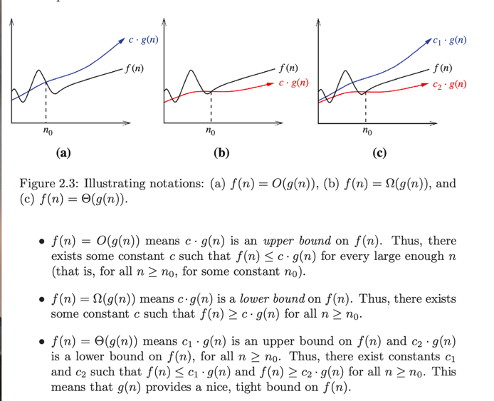
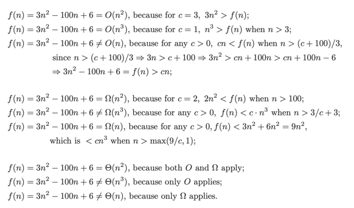
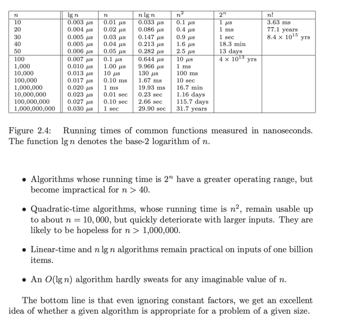

# Algorithm Analysis

Some external factors affect the time it takes for a function to run: 
the speed of the processor, what else the computer is running, etc. 
So it’s hard to make strong statements about the **exact runtime** 
of an algorithm. Instead we use big O notation to express **how quickly its runtime grows**.

The Big Oh notation ignores the difference between multiplicative constants. 
The functions f(n) = 2n and g(n) = n are identical in Big Oh analysis. 
This makes sense given our application. 
Suppose a given algorithm in (say) C language ran twice as fast 
as one with the same algorithm written in Java. 
This multiplicative factor of two can tell us nothing about the algorithm itself, 
because both programs implement exactly the same algorithm. 
We should ignore such constant factors when comparing two algorithms.

The Big Oh notation provides for a rough notion of equality when comparing functions. 
It is somewhat jarring to see an expression like n^2 = O(n^3), 
but its meaning can always be resolved by going back to the definitions in terms of upper and lower bounds. 
It is perhaps most instructive to read the “=” here as meaning **one of the functions that are**. 
Clearly, n^2 is one of the functions that are O(n^3).

1. **Constant functions**, f(n) = 1: Such functions might measure the cost of adding two numbers, 
printing out “The Star Spangled Banner,” or the growth realized 
by functions such as f(n) = min(n,100). 
In the big picture, there is no dependence on the parameter n.
2. **Logarithmic functions**, f (n) = log n: Logarithmic time complexity shows up in algorithms 
such as binary search. Such functions grow quite slowly as n gets big, 
but faster than the constant function (which is standing still, after all). Logarithms arise in any process where things are repeatedly halved
3. **Linear functions**, f(n) = n: Such functions measure the cost of looking at each item once 
(or twice, or ten times) in an n-element array, say to identify the biggest item, 
the smallest item, or compute the average value.
4. **Superlinear functions**, f(n) = nlgn: This important class of functions arises in such 
algorithms as quicksort and mergesort. They grow just a little faster than linear, 
but enough so to rise to a higher dominance class.
5. **Quadratic functions**, f(n) = n^2: Such functions measure the cost of looking 
at most or all pairs of items in an n-element universe. 
These arise in algorithms such as insertion sort and selection sort.
6. **Cubic functions**, f(n) = n^3: Such functions enumerate all triples of items in an n-element 
universe. These also arise in matrix multiplication and certain dynamic programming algorithms
7. **Exponential functions**, f(n) = cn for a given constant c > 1: Functions like 2n arise 
when enumerating all subsets of n items. As we have seen, exponential algorithms 
become useless fast, but not as fast as. . .
8. **Factorial functions**, f(n) = n!: Functions like n! arise when generating all permutations 
or orderings of n items.

### Logarithms and Their Applications

A height h tree with d children per node has d^h leaves. 
Here h = 3 and d = 3 (left). 
The number of bit patterns grows exponentially with pattern length (right). 
These would be described by the root-to-leaf paths of a binary tree of height h = 3.

Exponential functions grow at a distressingly fast rate. 
Thus, inverse exponential functions (logarithms) grow refreshingly slowly. 
**Logarithms arise in any process where things are repeatedly halved.**

#### Logarithms and Binary Search

Binary search is a good example of an O(log n) algorithm. 
To locate a particular person p in a telephone book containing n names, 
you start by comparing p against the middle, or (n/2)nd name, 
say Monroe, Marilyn. 
Regardless of whether p belongs before this middle name (Dean, James) or after it (Presley, Elvis), 
after just one comparison you can discard one half of all the names in the book. 
The number of steps the algorithm takes equals the number of times we can halve n until only one name is left. 
By definition, this is exactly log2(n). 
Thus, twenty comparisons suffice to find any name in the million-name Manhattan phone book!
Binary search is one of the most powerful ideas in algorithm design. This power becomes apparent if we imagine trying to find a name in an unsorted telephone book.

#### Logarithms and Trees

# References:

1. The Algorithm Design Manual, Steven S Skiena
2. [Доступное введение в анализ сложности алгоритмов.](http://discrete.gr/complexity/?ru)
3. [Video no. 1-16](https://www.youtube.com/playlist?list=PLDN4rrl48XKpZkf03iYFl-O29szjTrs_O) Abdul Bari's Algorithm Playlist (video)
4. [A Gentle Introduction to Algorithm Complexity Analysis](http://discrete.gr/complexity/)
5. [UC Berkeley Big O (video)](https://archive.org/details/ucberkeley_webcast_VIS4YDpuP98)
6. [UC Berkeley Big Omega (video)](https://archive.org/details/ucberkeley_webcast_ca3e7UVmeUc)
7. [Amortized Analysis (video)](https://www.youtube.com/watch?v=B3SpQZaAZP4&index=10&list=PL1BaGV1cIH4UhkL8a9bJGG356covJ76qN)
8. TopCoder (includes recurrence relations and master theorem):
    1. [Computational Complexity: Section 1](https://www.topcoder.com/community/data-science/data-science-tutorials/computational-complexity-section-1/)
    2. [Computational Complexity: Section 2](https://www.topcoder.com/community/data-science/data-science-tutorials/computational-complexity-section-2/)
9. [Знай сложности алгоритмов](https://habr.com/ru/post/188010/)
10. [TimeComplexity in Python](https://wiki.python.org/moin/TimeComplexity)
11. [ttps://www.bigocheatsheet.com/](https://www.bigocheatsheet.com/)