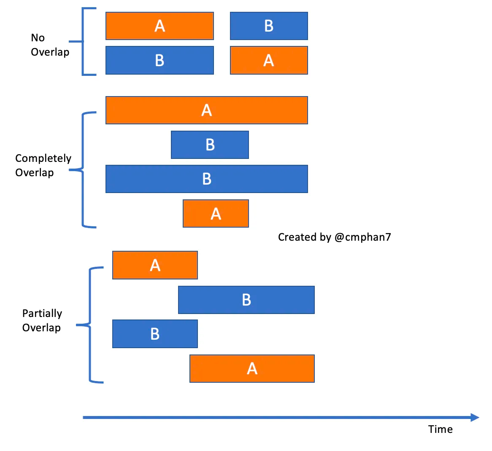

# Tricks To Solve Any Interval/Conflict Schedule Related Problems

Intervals can either be a period of time or a range of numbers. 
There are many popular scheduling problems: 
how to allow customers to book table at a restaurant without conflict? 
How to schedule resources on a CPU ? How to assign class to teachers? 
Therefore, there are many Leetcode problems that involve the interval operations.

The Overlapping Intervals pattern is used to merge or handle overlapping intervals in an array.

In an interval array sorted by start time, two intervals [a, b] and [c, d] overlap if b >= c (i.e., the end time of the first interval is greater than or equal to the start time of the second interval).


## 1. Understand the basic interval relations

There are not that many interval relations. 
If you understand them clearly, you will be able to implement and solve interval related problems easily. 
Let’s say if we have 2 intervals A and B, what are the possible relations between them?



Obviously, we only have 3 possible cases between two intervals A and B: 
- No Overlap
- Completely Overlap
- Partially Overlap

## 2. Sort the intervals first

If it’s an interval problem and the given input is not in a sorted order, 
we might need to consider sorting the input in non-decreasing order first. 
Most of the time, intervals are just a collection of period of time or integer values starting 
from left to right in a 2-dimension, here the x-axis (redline below) values are increasing from left to right. 
Note that each interval will have [start, end] format values, we should sort using the start time/value.

> Intervals.sort(); //Sort by start time first => Take O(nlogn)

## 3. Understand the merge operation

For non-overlap intervals, there are nothing to merge. 
We only need to care about merge in overlap cases. 
We first need to check to make sure two intervals are overlapping first before any merge operation can take place. 
We can tell two intervals are overlapping if one starts before the previous interval even finishes.

Check if `b.start ≤ a.end` for overlapping/mergeable. => `mergedIntervalEnd = Math.max(a.end, b.end)`


## 4. Understand the intersect operation

For non-overlap intervals, there are no intersection.

For overlapping, the best way to check between A and B is if the latest interval starts before the earliest interval end.

Check if `Math.max(a.start, b.start) ≤ Math.min(a.end, b.end)` =>  intersectInterval = `[Math.max(a.start, b.start), 
Math.min(a.end, b.end)]`

For example, we in a non-overlapping case as the picture below, 
the `Latest Start = Math.max(a.start, b.start) ≥ Earliest End = Math.min(a.end, b.end)`. 
Otherwise, everything else will be in overlapping cases. Since there are overlapping, there will be intersections.


## 5. Typical examples

My realisation of the intervals tasks:

```python
intervals.sort(key=lambda interval: interval[0])

i, intervals_len = 0, len(intervals)
while i < intervals_len - 1:
    if intervals[i][1] >= intervals[i + 1][0]:
        start = min(intervals[i][0], intervals[i+1][0])
        end = max(intervals[i][1], intervals[i+1][1])
        merged_interval = [start, end]
        intervals[i], intervals[i + 1] = [], merged_interval

    i += 1

return [interval for interval in intervals if interval]
```

How to find common interval (986)

```python
i, j, result = 0, 0, []
while i < len(firstList) and j < len(secondList):
    start = max(firstList[i][0], secondList[j][0])
    end = min(firstList[i][1], secondList[j][1])

    if start <= end:
        result.append([start, end])

    # Find the smallest and go further
    if firstList[i][1] < secondList[j][1]:
        i += 1
    else:
        j += 1
```

We can skip partially the array using the same counter variable (228):

```python
i = 0
while i < len(nums):
    start = nums[i]
    while i < len(nums) - 1 and nums[i + 1] - nums[i] == 1:
        i += 1

    if start == nums[i]:
        result.append(str(nums[i]))
    else:
        result.append(f"{start}->{nums[i]}")

    i += 1
```

## Sample Problem:
Given a list of intervals, merge all overlapping intervals.

### Example:

- Input: intervals = [[1, 3], [2, 6], [8, 10], [15, 18]]
- Output: [[1, 6], [8, 10], [15, 18]]

### Explanation:
1. Sort the intervals by their start time.
2. Create an empty list called merged to store the merged intervals.
3. Iterate through the intervals and check if it overlaps with the last interval in the merged list.
4. If it overlaps, merge the intervals by updating the end time of the last interval in merged.
5. If it does not overlap, simply add the current interval to the merged list.

## LeetCode Problems:
1. Merge Intervals (LeetCode #56)
2. Insert Interval (LeetCode #57)
3. Non-Overlapping Intervals (LeetCode #435)

# References:

1. An Easier Way to Solve All “Stock Trading” Questions on Leetcode
