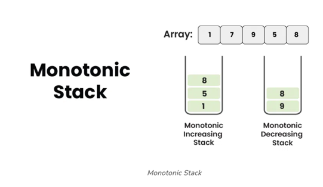

# Monotonic Stack

> A monotonic stack is a data structure that maintains either non-increasing or non-decreasing order of elements.

**Advantages:**
1. Efficient for finding the next greater or smaller element in an array. 
2. Useful for solving a variety of problems, such as finding the nearest smaller element or calculating the maximum area of histograms. 
3. In many cases, the time complexity of algorithms using monotonic stacks is linear, making them efficient for processing large datasets.

**Disadvantages:**
1. Requires extra space to store the stack.
2. May not be intuitive for beginners to understand and implement.



Unlike traditional stacks, Monotonic Stacks ensure that elements inside the stack 
are arranged in an increasing or decreasing order based on their arrival time. 
In order to achieve the monotonic stacks, we have to enforce the push and pop operation 
depending on whether we want a monotonic increasing stack or monotonic decreasing stack.

Monotonic: It is a word for mathematics functions. 
A function y = f(x) is monotonically increasing or decreasing when it follows the below conditions:
1. As x increases, y also increases always, then it’s a monotonically increasing function. 
2. As x increases, y decreases always, then it’s a monotonically decreasing function.

See the below examples:
1. y = 2x +5, it’s a monotonically increasing function.
2. y = -(2^x), it’s a monotonically decreasing function. 

Similarly, A stack is called a monotonic stack if all the elements starting 
from the bottom of the stack is either in increasing or in decreasing order.

## Types of Monotonic Stack:

### 1. Monotonic Increasing Stack

A Monotonically Increasing Stack is a stack where elements are placed in increasing order from the bottom to the top.

Example: 1, 3, 10, 15, 17

1. Initialize an empty stack.
2. Iterate through the elements and for each element:
   * while stack is not empty AND top of stack is more than the current element
     - pop element from the stack
   * Push the current element onto the stack.
3. At the end of the iteration, the stack will contain the monotonic increasing order of elements.

```Python
def monotonic_increasing(nums):
    stack = []

    # Traverse the array
    for num in nums:
        # While stack is not empty AND top of stack is more than the current element
        while stack and stack[-1] > num:
            # Pop the top element from the stack
            stack.pop()
        # Push the current element into the stack
        stack.append(num)

    return stack
```

Complexity Analysis:
1. Time Complexity: O(N), each element from the input array is pushed and popped from the stack exactly once. Therefore, even though there is a loop inside a loop, no element is processed more than twice.
2. Auxiliary Space: O(N)

### 2. Monotonic Decreasing Stack

A Monotonically Decreasing Stack is a stack where elements are placed in decreasing order from the bottom to the top. 

Example: 17, 14, 10, 5, 1

1. Start with an empty stack.
2. Iterate through the elements of the input array. 
   * While stack is not empty AND top of stack is less than the current element:
     - pop element from the stack
   * Push the current element onto the stack.
3. After iterating through all the elements, the stack will contain the elements in monotonic decreasing order.

```Python
def monotonic_decreasing(nums):
    stack = []

    # Traverse the array
    for num in nums:
        # While stack is not empty AND top of stack is less than the current element
        while stack and stack[-1] < num:
            # Pop the top element from the stack
            stack.pop()
        # Push the current element into the stack
        stack.append(num)

    return stack
```

Complexity Analysis:
1. Time Complexity: O(N), each element is processed only twice, once for the push operation and once for the pop operation.
2. Auxiliary Space: O(N) 

## Key Points to Identify Monotonic Stack Problems

1. **Nearest Greater or Smaller Element**: Monotonic stacks are commonly used to find the nearest greater or smaller element to the left or right of each element in an array or sequence. If a problem requires you to find such elements efficiently, it’s a strong indicator that a monotonic stack might be useful.
2. Monotonic Property: The term “monotonic” refers to the fact that the stack maintains a specific ordering property. There are two types of monotonic stacks:
   * Increasing Monotonic Stack: This stack is used when you need to find the nearest smaller element to the right for each element. It keeps elements in non-decreasing order, meaning the top of the stack contains the largest element seen so far. 
   * Decreasing Monotonic Stack: This stack is used when you need to find the nearest greater element to the right for each element. It keeps elements in non-increasing order, meaning the top of the stack contains the smallest element seen so far.
3. Problems Involving Element Removal: Monotonic stacks are often used in problems where you need to remove elements from the stack once their purpose is fulfilled. Elements are pushed onto the stack while certain conditions are met, and they are popped when no longer relevant.
4. Immediate Neighbours: The problems that require finding immediate neighbours, such as the nearest greater or smaller elements to the left or right, are good candidates for a monotonic stack.
5. Monotonicity Changes: Some problems involve changing monotonicity requirements during traversal, which can be handled using a combination of increasing and decreasing monotonic stacks.
6. Typical Use Cases: Monotonic stacks are often used in scenarios like finding the next greater element, next smaller element, calculating the maximum area under histograms, evaluating expressions with infix to postfix conversion, and solving problems related to stock span, building and trapping rainwater, etc.
7. Problems with Linear Time Constraints: If the problem statement mentions that you need to solve it in linear time, or it hints at optimizing the time complexity, a monotonic stack might be beneficial.

## Applications of Monotonic Stack
Here are some applications of monotonic stacks:

1. [Finding Next Greater Element](https://www.geeksforgeeks.org/introduction-to-monotonic-stack-2/#:~:text=Finding%20Next%20Greater%20Element): Monotonic stacks are often used to find the next greater element for each element in an array. This is a common problem in competitive programming and has applications in various algorithms.
2. [Finding Previous Greater Element](https://www.geeksforgeeks.org/previous-greater-element/): Similarly, monotonic stacks can be used to find the previous greater element for each element in an array.
3. [Finding Maximum Area Histogram](https://www.geeksforgeeks.org/introduction-to-monotonic-stack-2/#:~:text=Finding%20Maximum%20Area%20Histogram): Monotonic stacks can be applied to find the maximum area of a histogram. This problem involves finding the largest rectangular area possible in a given histogram.
4. [Finding Maximum Area in Binary Matrix](https://www.geeksforgeeks.org/introduction-to-monotonic-stack-2/#:~:text=Finding%20Maximum%20Area%20in%20Binary%20Matrix): Monotonic stacks can also be used to find the maximum area of a rectangle in a binary matrix. This is a variation of the maximum area histogram problem.
5. [Finding Sliding Window Maximum/Minimum:](Finding Sliding Window Maximum/Minimum) Monotonic stacks can be used to efficiently find the maximum or minimum elements within a sliding window of a given array.
6. [Expression Evaluation](Expression Evaluation): Monotonic stacks can be used to evaluate expressions involving parentheses, such as checking for balanced parentheses or evaluating the value of an arithmetic expression.

# References:
1. [Monotonic Stack + List of problems on Leetcode](!https://liuzhenglaichn.gitbook.io/algorithm/monotonic-stack)
2. [Introduction to monotonic stack that everyone can understand](!https://medium.com/@florian_algo/introduction-to-monotonic-stack-that-everyone-can-understand-e5f54467faaf)
3. [Monotonic Stack — Identify Pattern](!https://itnext.io/monotonic-stack-identify-pattern-3da2d491a61e)